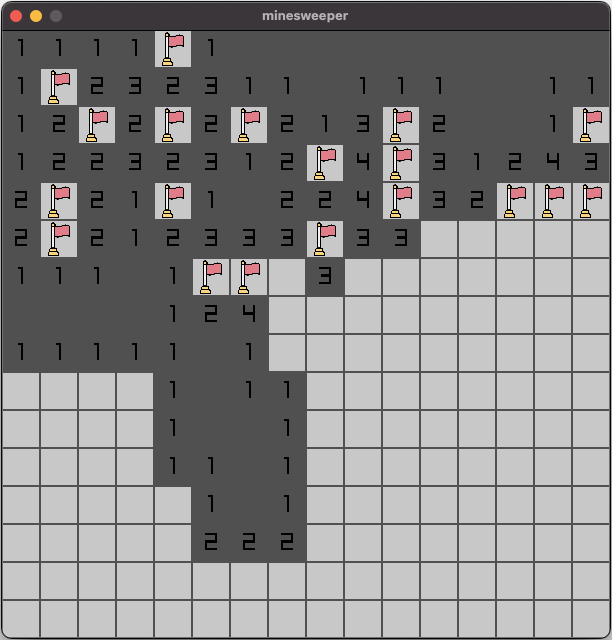
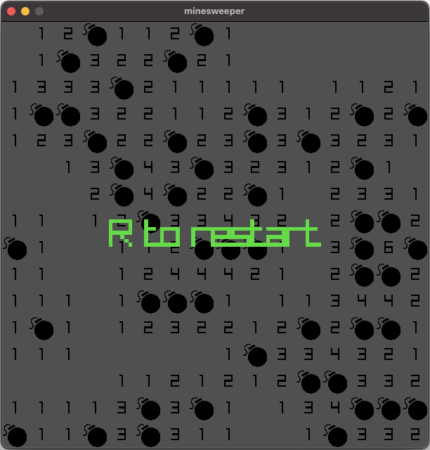

### CMake

- Extract the zip of this project
- Type the follow command:

```sh
cmake -S . -B build
```

> if you want with debug symbols put the flag `-DCMAKE_BUILD_TYPE=Debug`

- After CMake config your project build:

```sh
cmake --build build
```

- Inside the build folder are another folder (named the same as the project name on CMakeLists.txt) with the executable and resources folder.
- In order for resources to load properly, cd to `src` and run the executable (`../build/minesweeper/minesweeper`) from there.

- cmake will automatically download a current release of raylib but if you want to use your local version you can pass `-DFETCHCONTENT_SOURCE_DIR_RAYLIB=<dir_with_raylib>` 

## minesweeper

To open a cell, click on a cell.
To flag a cell, right click a cell or hover over a cell and press F.
The number of a cell tells you how many adjacent tiles are bombs.
If you open a cell and it is a bomb, you lose.
You win when you open all non-bomb cells.




### description

This is a copy of Minesweeper written in C and raylib.
