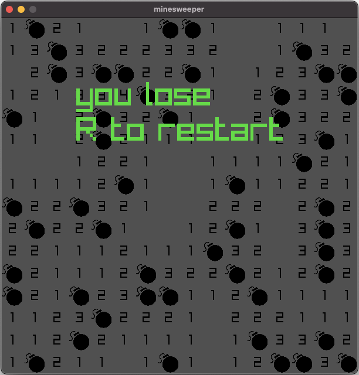

### CMake

- Extract the zip of this project
- Type the follow command:

```sh
cmake -S . -B build
```

> if you want with debug symbols put the flag `-DCMAKE_BUILD_TYPE=Debug`

- After CMake config your project build:

```sh
cmake --build build
```

- In order for resources to load properly, cd to `build` and run the executable (`./minesweeper`) from there.

- CMake will automatically download a current release of raylib but if you want to use your local version you can pass `-DFETCHCONTENT_SOURCE_DIR_RAYLIB=<dir_with_raylib>` 

## minesweeper

- To open a cell, click on a cell.

- To flag a cell, right click a cell or hover over a cell and press F.
The number in a cell tells you how many adjacent tiles are bombs.

- If you open a cell and it is a bomb, you lose.

- You win when you open all non-bomb cells.





### description

This is a copy of Minesweeper written in C and raylib.
